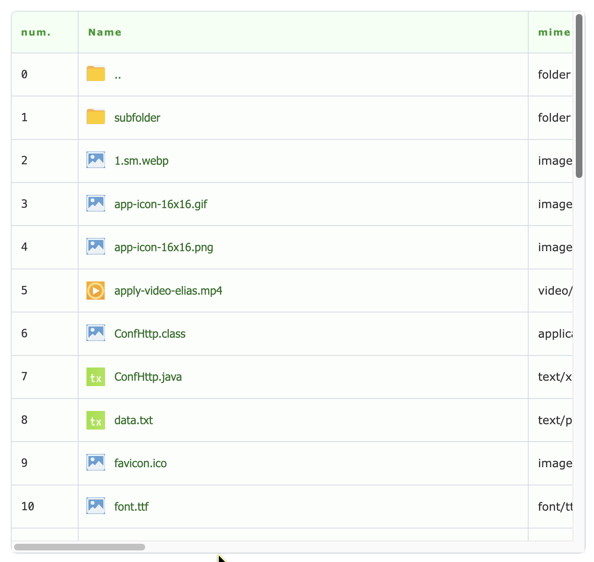
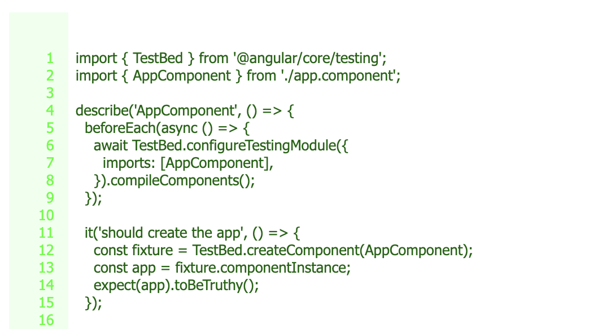
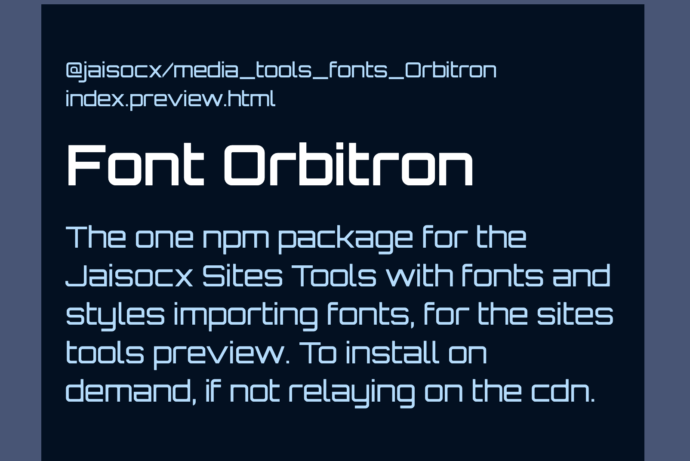
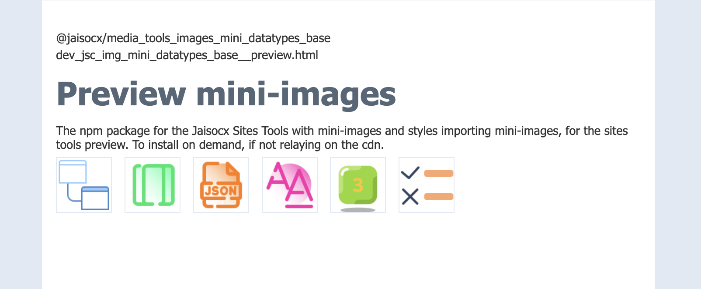
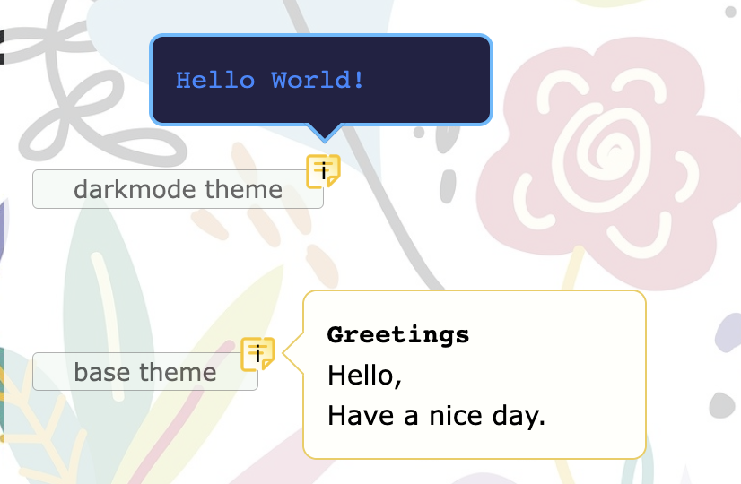
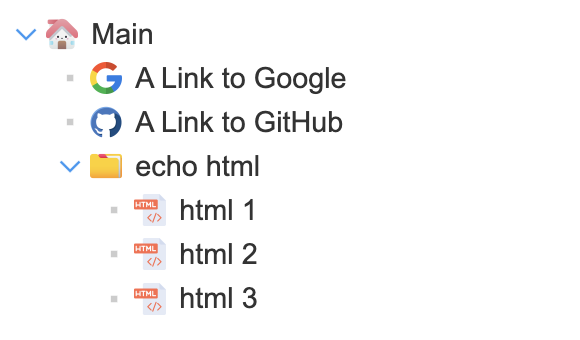

In reconstruction, the preview site comes later.

# Jaisocx Sites Tools

> Source code of packages, 
written in **typescript** programming language 
and published in `@jaisocx` namespace 
**for installation** with `yarn` or `npm`.

---

  
## Sites Tools

### A) CSS Tools

---

### B) CSS Tools with CSS Events

---

### C) Media Libs

---

### D) JS Tools

---

### E) JSON Rendering Tools

---

## Packages Templates

---

1. Typescript development
2. Sites Tools development
3. Webpack Builds

## Programming Patterns

---

I think of implementing in typescript 
the well known development patterns.

## Examples

---

1. HTML pages with Webpack Builds of Sites Tools
2. HTML pages with Sites Tools

## Base typescript packages

---

**Areas of development several tasks solved**

1. Themes
2. Responsive support in `.css`
3. Emails Rendering Quality
4. Command Line Shell `bash`
5. Optimization
   * HTML templates transparency ( Template Renderer for JSON Rendering Tools )
   * Optimization for DOM Reactivity ( Improved Renderer Event Emitter )
   * RAM for DOM ( thin html templates )
   * Traffic, requests number minimization ( Workarounds for CDN and Preloading )
   * Public repositories storage space ( Workarounds for CDN and Media storing repos )
   * Parsing ( ObjData )

