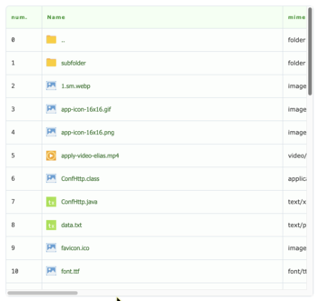
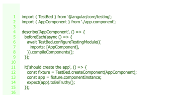
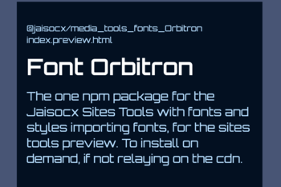

# JAISOCX™ SITES TOOLS®

> In reconstruction, the preview site comes later.

Source code of packages, 
written in **typescript** programming language 
and published in `@jaisocx` namespace 
**for installation** with `yarn` or `npm`.

## 🌿 Sites Tools

### 🌿 CSS Tools

[https://jaisocx-tools.github.io/jaisocx_sites_tools/examples_html/sites_tools/css_clean_start_lite_preview.html](https://jaisocx-tools.github.io/jaisocx_sites_tools/examples_html/sites_tools/css_clean_start_lite_preview.html)

[https://jaisocx-tools.github.io/jaisocx_sites_tools/examples_html/sites_tools/css_tool_template_preview.html](https://jaisocx-tools.github.io/jaisocx_sites_tools/examples_html/sites_tools/css_tool_template_preview.html)

[https://jaisocx-tools.github.io/jaisocx_sites_tools/examples_html/sites_tools/css_code_snippet_preview.html](https://jaisocx-tools.github.io/jaisocx_sites_tools/examples_html/sites_tools/css_code_snippet_preview.html)

### 🌿 Media Libs

[https://jaisocx-tools.github.io/jaisocx_sites_tools/examples_html/sites_tools/fonts_base_preview.html](https://jaisocx-tools.github.io/jaisocx_sites_tools/examples_html/sites_tools/fonts_base_preview.html)

[https://jaisocx-tools.github.io/jaisocx_sites_tools/examples_html/sites_tools/font_orbitron_preview.html](https://jaisocx-tools.github.io/jaisocx_sites_tools/examples_html/sites_tools/font_orbitron_preview.html)

[https://jaisocx-tools.github.io/jaisocx_sites_tools/examples_html/sites_tools/img_datatypes_base_preview.html](https://jaisocx-tools.github.io/jaisocx_sites_tools/examples_html/sites_tools/img_datatypes_base_preview.html)

### 🌿 JS Tools

### 🌿 JSON Rendering Tools

## 🌿 Examples
1. HTML pages with Webpack Builds of Sites Tools
2. HTML pages with Sites Tools

## Packages Templates
1. Typescript development
2. Sites Tools development
3. Webpack Builds

## Programming Patterns
> I think of publishing in typescript 
the well known development patterns.

## Base typescript packages

[README_packages.md](./README_packages.md)

**Areas of development, with several tasks solved**

1. Themes
2. Responsive support in `.css`
3. Emails Rendering Quality
4. Command Line Shell `bash`
5. Optimization

     * HTML templates transparency ( Template Renderer for JSON Rendering Tools )
     * Optimization for DOM Interactivity ( Improved Renderer Event Emitter )
     * RAM for DOM ( thin html templates )
     * Traffic, requests number minimization ( Workarounds for CDN and Preloading )
     * Public repositories storage space ( Workarounds for CDN and Media storing repos )
     * Parsing ( ObjData )

