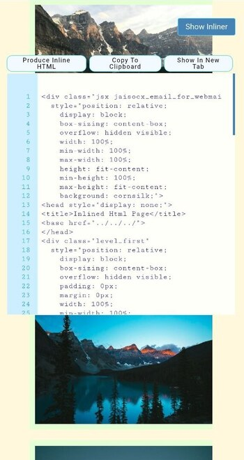
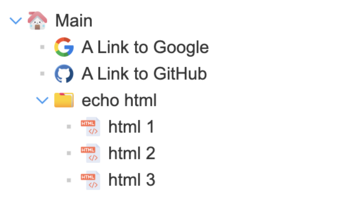
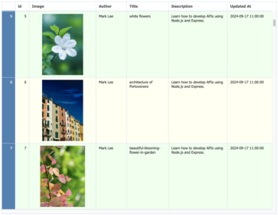
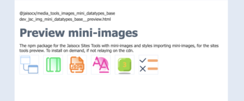

# JAISOCX™ SITES TOOLS®

> In reconstruction, the preview site comes later.

Source code of packages, 
written in **typescript** programming language 
and published in `@jaisocx` namespace 
**for installation** with `yarn` or `npm`.

## News 

  🗓 Summer 🌼 2026, 30. July AD 2026 12:30 UTC. **clean_start_tiny**
[libraries/sites_tools/css_tools/CleanStart_Tiny/README.md](./libraries/sites_tools/css_tools/CleanStart_Tiny/README.md)

## 🌿 Sites Tools

### 🌿 Workarounds for Email viewed in Webmail

  📙 [README @jaisocx/email-html-inliner](./libraries/sites_tools/js_tools/EmailHtmlInliner/README.md)
  
  🌐 [https://jaisocx-tools.github.io/jaisocx_sites_tools/examples/html_pages/email_html/email_html_images.html](https://jaisocx-tools.github.io/jaisocx_sites_tools/examples/html_pages/email_html/email_html_images.html)

---

### 🌿 JSON Styling Tools

  📙 [README @jaisocx/tree](./libraries/sites_tools/json_styling_tools/Tree/README.md)

  🌐 [https://jaisocx-tools.github.io/jaisocx_sites_tools/examples/html_pages/sites_tools/tree_preview.html](https://jaisocx-tools.github.io/jaisocx_sites_tools/examples/html_pages/sites_tools/tree_preview.html)

---

  📙 [README @jaisocx/jstable](./libraries/sites_tools/json_styling_tools/jstable/README.md)

  🌐 [https://jaisocx-tools.github.io/jaisocx_sites_tools/libraries/sites_tools/json_styling_tools/jstable/www/example_imaged_data.html](https://jaisocx-tools.github.io/jaisocx_sites_tools/libraries/sites_tools/json_styling_tools/jstable/www/example_imaged_data.html)

---

### 🌿 JS Tools

  📙 [README @jaisocx/tooltip](./libraries/sites_tools/js_tools/Tooltip/README.md)

  🌐 [https://jaisocx-tools.github.io/jaisocx_sites_tools/examples/webpack_builds/webpack_Tooltip/ExampleWebpack_Tooltip.html](https://jaisocx-tools.github.io/jaisocx_sites_tools/examples/webpack_builds/webpack_Tooltip/ExampleWebpack_Tooltip.html)

---

### 🌿 CSS Tools

  📙 [README @jaisocx/css_tool_template](./examples/templates/templ_Css_SitesTool/README.md)

  🌐 [https://jaisocx-tools.github.io/jaisocx_sites_tools/examples/html_pages/sites_tools/css_tool_template_preview.html](https://jaisocx-tools.github.io/jaisocx_sites_tools/examples/html_pages/sites_tools/css_tool_template_preview.html)

---

  📙 [README @jaisocx/css-table](./libraries/sites_tools/css_tools/css_flat/CssTable/README.md)

  🌐 [https://jaisocx-tools.github.io/jaisocx_sites_tools/examples/html_pages/sites_tools/css_table_imaged_preview.html](https://jaisocx-tools.github.io/jaisocx_sites_tools/examples/html_pages/sites_tools/css_table_imaged_preview.html)

  📙 [README @jaisocx/css-table-ordered](./libraries/sites_tools/js_tools/CssTableOrdered/README.md)

  🌐 [https://jaisocx-tools.github.io/jaisocx_sites_tools/examples/html_pages/sites_tools/css_table_imaged_orderby_preview.html](https://jaisocx-tools.github.io/jaisocx_sites_tools/examples/html_pages/sites_tools/css_table_imaged_orderby_preview.html)

---

  📙 [README @jaisocx/css-code-snippet](./libraries/sites_tools/css_tools/css_flat/CssCodeSnippet/README.md)

  🌐 [https://jaisocx-tools.github.io/jaisocx_sites_tools/examples/html_pages/sites_tools/css_code_snippet_preview.html](https://jaisocx-tools.github.io/jaisocx_sites_tools/examples/html_pages/sites_tools/css_code_snippet_preview.html)

---

### 🌿 Media Libs

  📙 [README @jaisocx/media_tools_fonts_orbitron](./libraries/sites_tools/media_tools/JscFonts_Orbitron/README.md)

  🌐 [https://jaisocx-tools.github.io/jaisocx_sites_tools/examples/html_pages/fonts/font_orbitron_preview.html](https://jaisocx-tools.github.io/jaisocx_sites_tools/examples/html_pages/fonts/font_orbitron_preview.html)

  📙 [README @jaisocx/media_tools_fonts_base](./libraries/sites_tools/media_tools/JscFonts_base/README.md)

  🌐 [https://jaisocx-tools.github.io/jaisocx_sites_tools/examples/html_pages/fonts/fonts_base_preview.html](https://jaisocx-tools.github.io/jaisocx_sites_tools/examples/html_pages/fonts/fonts_base_preview.html)

---

  📙 [README @jaisocx/media_tools_images_mini_datatypes_base](./libraries/sites_tools/media_tools/JscImages_mini_datatypes_base/README.md)

  🌐 [https://jaisocx-tools.github.io/jaisocx_sites_tools/examples/html_pages/image_pack/img_datatypes_base_preview.html](https://jaisocx-tools.github.io/jaisocx_sites_tools/examples/html_pages/image_pack/img_datatypes_base_preview.html)

## 🌿 Examples
1. HTML pages with Webpack Builds of Sites Tools
2. HTML pages with Sites Tools

## Packages Templates
1. Typescript development
2. Sites Tools development
3. Webpack Builds

## Programming Patterns
> I think of publishing in typescript the well known development patterns.

## Base typescript packages

[.readme/md/README_base_packs.md](./readme/md/README_base_packs.md)

**Areas of development, with several tasks solved**

1. Themes
2. Responsive support in `.css`
3. Emails Rendering Quality
4. Command Line Shell `bash`
5. Optimization

     * HTML templates transparency ( Template Renderer for JSON Rendering Tools, TreeWalker base methods )
     * Optimization for DOM Interactivity ( Improved Renderer Event Emitter )
     * RAM for DOM ( thin optimized html template renderer, optimized event listener )
     * Traffic, requests number minimization ( Workarounds for CDN and Preloading )
     * Public repositories storage space ( Workarounds for CDN, Webpack and Media storing repos )
     * Parsing ( ObjData )

