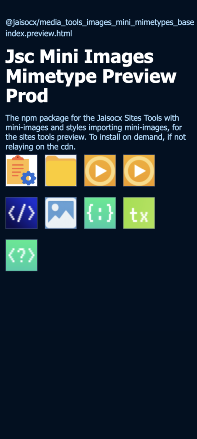
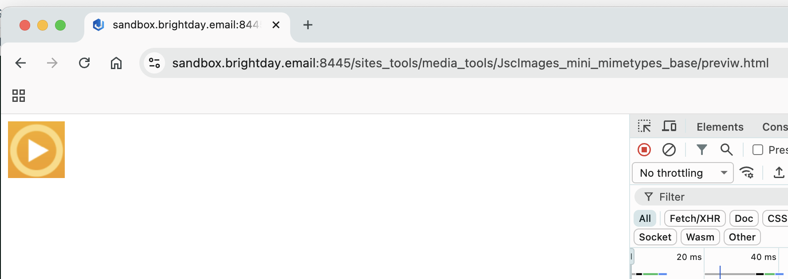

# Set of mini images

`@jaisocx/media_tools_images_mini_mimetypes_base`


## Aim Of The Setup

So that other sites tools
don't have to publish mini-images along with `.ts` and `.css`
for preview purposes.


## What is this

Set of images published once,
to mention **in other sites tools** in `package.json` dependencies,
for the preview,
`index.preview.html`,
and `.css` to **import** these mini images in `.html`
via css class name.




For example:

**CSS**

```css

/* MediaAndStyles/JscImages_mini_mimetypes_base_main_relative.css */

.jsc .JscImages_mini_mimetypes_base .mini-image.mimetype.audio {
  background-image: url("./images/audio_and_video_mime_type.png");
}

```


**HTML Node**

```html

<item class="mini-image mimetype audio"></item>

```


**HTML Page**

```html

<!DOCTYPE html>
<html lang="en" class="jsx theme_darkmode jsc">
<head>
  <link
      rel="stylesheet"
      type="text/css"
      charset="utf-8"
      href="MediaAndStyles/JscImages_mini_mimetypes_base_main_preprocessed_relative.css"
  />
</head>
<body>
  <images-block class="JscImages_mini_mimetypes_base">
    <item class="mini-image mimetype audio"></item>
  </images-block>
</body>
</html>
```



