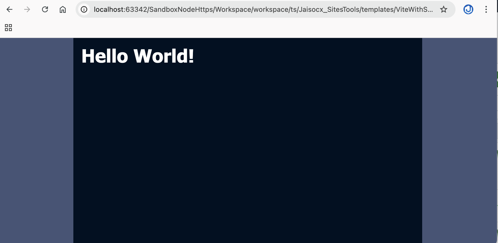

# Vite Framework Template




## Transpile

```bash

cd "${dir_where_Vite_devDependency_in_package_json}"
npx vite build --config "${this_package_path}/vite.config.ts"

```


```bash

docker compose exec ts bash
cd "/opt/jaisocx/sites_tools/workspace/ts"
npx vite build --config "./Jaisocx_SitesTools/templates/ViteWithSassAndLess/vite.config.ts"

```

## The Site

```fs
"${this_package_path}/dist/index.html"
```

